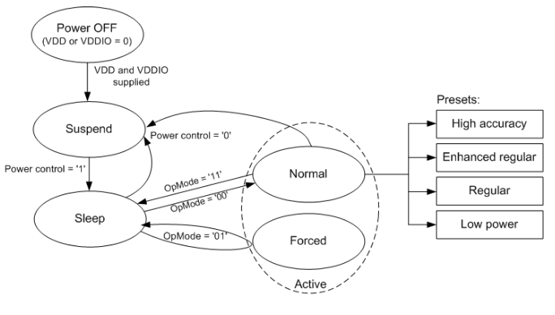
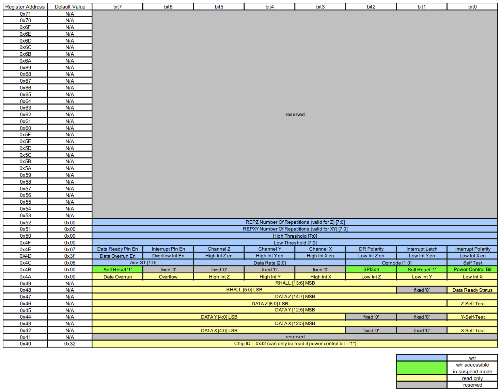

# FPGA-based SPI Master Interface for Magnetometer Sensor BMM150

The BMM150 is a low-power, high-resolution 3-axis digital geomagnetic sensor. This repository provides a SystemVerilog implementation of an SPI Master designed to communicate with the sensor. FPGA/ASIC designers can easily integrate this SPI Master with their designs.

## Features

- Magnetic field range: ±1300 µT (X/Y), ±2500 µT (Z)
- Resolution: 0.3 µT
- Supporting register burst reads

## Power Modes

## Register Map

| Register  | Name           | Description                      |
| --------- | -------------- | -------------------------------- |
| 0x40      | CHIP_ID        | Should return 0x32               |
| 0x4B      | POWER_CTRL     | Bit 0 enables power              |
| 0x4C      | OPMODE/ODR     | Set operation mode and data rate |
| 0x42–0x49 | Data Registers | DATAX, DATAY, DATAZ, RHALL       |

### Data Format

- X/Y-axis: 13-bit signed (DATAX/Y_MSB[7:0] + DATAX/Y_LSB[4:0])
- Z-axis: 15-bit signed (DATAZ_MSB[7:0] + DATAZ_LSB[6:0])

## Data Sequence

1. **Power Up**
   - Write `0x01` to register `0x4B` to enable power
2. **Set Operation Mode**
   - Write `0x00` to register `0x4C` to enter Normal Mode at 10Hz
3. **Wait** ~10ms (depending on ODR)
4. **Burst Read** starting from register `0x42` (8 bytes):
   - DATAX_LSB
   - DATAX_MSB
   - DATAY_LSB
   - DATAY_MSB
   - DATAZ_LSB
   - DATAZ_MSB
   - RHALL_LSB
   - RHALL_MSB
